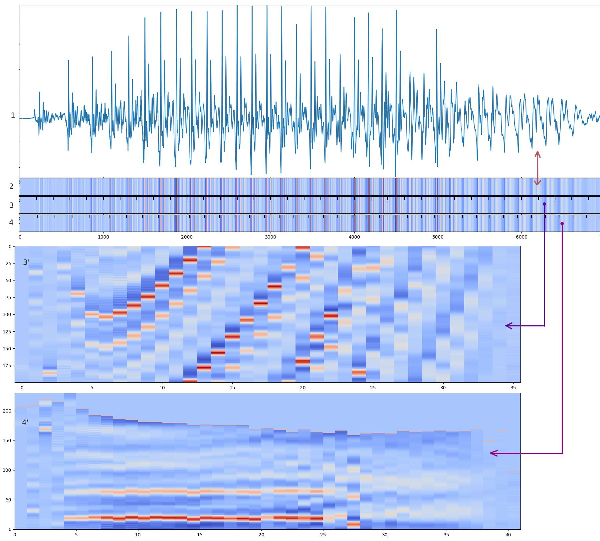

Iterative Pitch Refinement via Cycle Alignment
===

A visual demo of the pitch refinement process in action. 
The initial pitch envelope is determined by the [Crepe pitch tracker](https://github.com/marl/crepe) or 
[Librosa's Pyin](https://librosa.org/doc/main/generated/librosa.pyin.html) then refined by our algorithm.

The top left is a plot of cross correlations between a single cycle in the periodic signal and its neighbour cycle. 
The top right is a 'cyclogram' (described below). Bottom is the waveform of the voice recording, with ticks showing 
the period boundaries which drift around slightly as the refinement process iterates.  

---

## Cyclogram

To see how the cyclogram plot works, it's useful to see some simple transformations on a waveform. 

1. This is the waveform of a voice recording
2. This is the same waveform, but instead of a vertical amplitude axis, this uses a colour spectrum.
3. Annotating equal-spaced ticks; the spacing is arbitrary
   - 3' The a visual reshaping transformation, rotating segments according to the tick boundaries
4. The above, but with ticks aligned to period boundaries (as determined by our algorithm)
   - 4' The visual reshaping transformation, rotating segments according to the period-aligned tick-boundaries. 
   This is termed the 'cyclogram'

